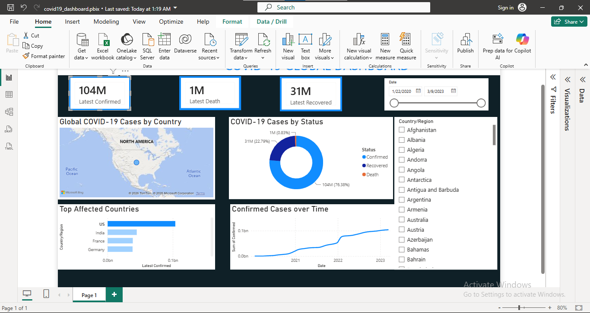

# COVID-19 Global Dashboard

## Overview

This project presents an interactive Power BI dashboard developed using the Johns Hopkins University Center for Systems Science and Engineering (CSSE) COVID-19 dataset. The dashboard was designed to transform raw pandemic data into meaningful visual insights, enabling users to monitor global COVID-19 trends, compare countries, and explore confirmed cases, deaths, and recoveries through interactive filtering.

The project demonstrates the complete analytical workflow, from data preparation and transformation to dashboard design and insight generation.

---

## Problem Statement

During the COVID-19 pandemic, large volumes of data were generated daily across different countries. Without proper visualization, identifying trends, comparing countries, and monitoring the progression of the pandemic becomes difficult.

This dashboard addresses that challenge by providing an interactive interface that enables users to explore COVID-19 statistics by country and date.

---

## Objectives

- Build an interactive Power BI dashboard using a real-world COVID-19 dataset.
- Monitor confirmed cases, deaths, and recoveries.
- Compare COVID-19 statistics across countries.
- Track changes in cases over time.
- Present insights through clear and interactive visualizations.

---

## Dataset

**Source:** Johns Hopkins University Center for Systems Science and Engineering (CSSE)

The dataset contains real-world COVID-19 records collected from official public health authorities worldwide.

### Fields Used

- Country/Region
- Province/State
- Date
- Confirmed Cases
- Deaths
- Recoveries
- Latitude
- Longitude

---

## Tools Used

- Microsoft Power BI
- Power Query
- DAX
- Microsoft PowerPoint

---

## Dashboard Features

The dashboard includes:

- KPI Cards
- Interactive World Map
- Line Chart
- Donut Chart
- Country Slicer
- Date Slicer

---

## Key Insights

- The United States recorded the highest number of confirmed COVID-19 cases in the dataset, with approximately **104 million** confirmed cases.
- India recorded the second-highest number of confirmed cases, with approximately **35 million** confirmed cases.
- Confirmed cases were significantly higher than deaths and recoveries across the countries analyzed.
- Interactive filters allow users to compare countries and specific dates.
- The dashboard provides a clear summary of global COVID-19 trends through interactive visualizations.

---

## Recommendations

- Strengthen disease surveillance and reporting systems.
- Continue using interactive dashboards to support public health monitoring.
- Update datasets regularly to improve decision-making.
- Promote data-driven approaches during future public health emergencies.

---

## Challenges Encountered

During the development of this project, several technical challenges were encountered and resolved, including:

- Recovering an accidentally removed column in Power Query.
- Resolving DAX measure errors affecting KPI cards.
- Fixing map visualization issues.
- Optimizing dashboard layout for better readability.
- Formatting visuals and improving user experience.

---

## Dashboard Preview



---

## Project Structure

```
COVID-19-Dashboard/
│
├── COVID-19 Dashboard.pbix
└── Presentation.pptx
```

---


### Skills Demonstrated

- Data Cleaning
- Data Transformation
- Data Visualization
- Dashboard Design
- DAX
- Power Query
- Business Insight Generation

---

## Conclusion

This project demonstrates how Power BI can be used to transform real-world health data into an interactive dashboard that supports analysis and decision-making. Beyond building the dashboard, the project strengthened practical skills in data preparation, visualization, troubleshooting, and communicating insights through data.

---

## Author

**Benjamin Umanta Esther**

Aspiring Data Analyst
